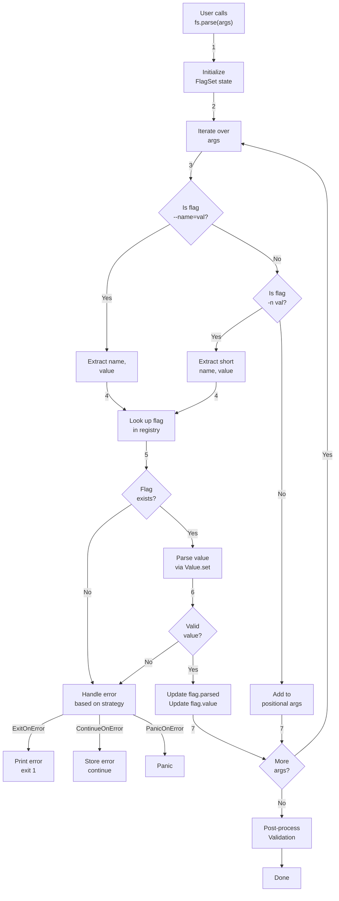
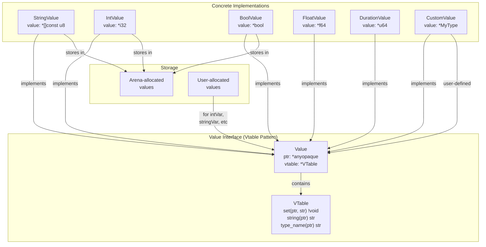
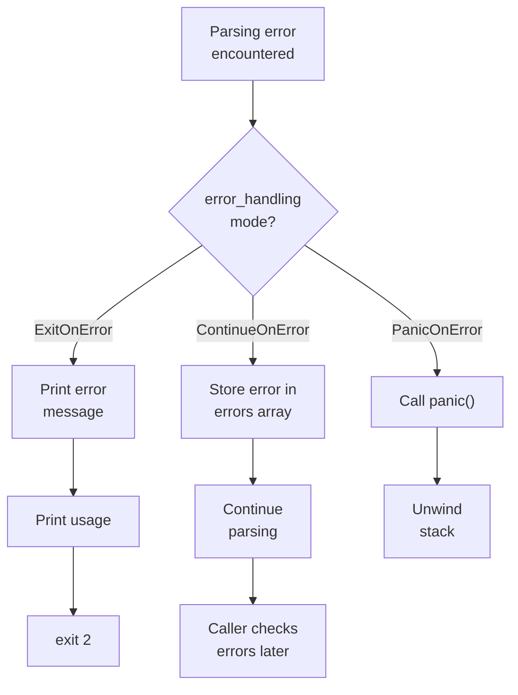
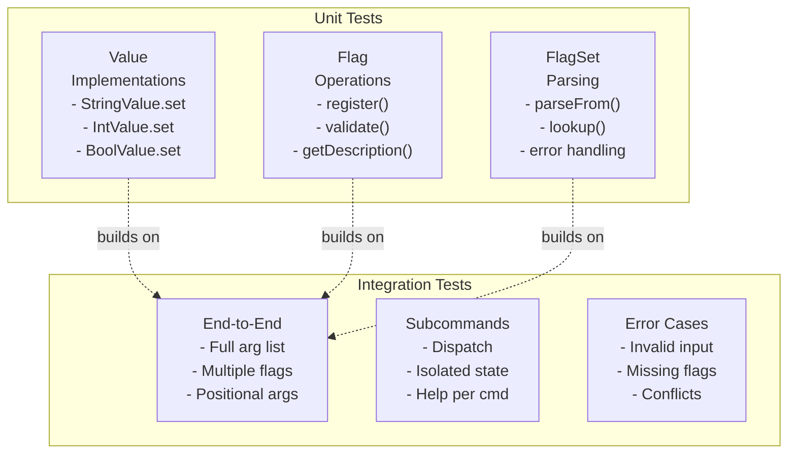

# ARCHITECTURE.md - Internal Design of flags.zig

This document describes **HOW flags.zig works internally** — the data structures, parsing pipeline, type system, and design patterns that power the library. For **WHAT features exist**, see [API_SPECIFICATION.md](API_SPECIFICATION.md) and [DESIGN_INSPIRATION.md](DESIGN_INSPIRATION.md).

---

## 1. Current Architecture (The Problem)

### Global State Model

The current implementation (`src/flags.zig`) uses a single global `StringHashMap`:

```zig
var entries: std.StringHashMap(Flag) = .init(std.heap.smp_allocator);

const FlagValues = union(enum) {
    boolean: bool,
    string: []const u8,
};

const Flag = struct {
    value: FlagValues,
    description: []const u8 = "",
};
```

**Flow:**
1. `parse()` reads command line args into global `entries` map
2. `string("name", default, desc)` and `boolean(name, default, desc)` look up in global map
3. No isolation, no FlagSet concept, no subcommands

### Why This Is Wrong

| Issue | Impact |
|-------|--------|
| **Global state** | Can't have multiple parsing contexts (e.g., subcommands, testing) |
| **Union-based values** | Can't support Int, Float, Duration, custom types easily |
| **No pointer returns** | API incompatible with Go's `flag` package |
| **Implicit registration** | Flags registered at call time, not definition time |
| **No help system** | Users can't discover flags or get help |
| **Memory management** | Global allocator, no cleanup semantics |

---

## 1.5 Parsing Strategies

The argument parser can be implemented with two different architectural approaches. Understanding the trade-offs is crucial for choosing when to add robustness.

### Simple Loop Parser (Phase 1)

**Best for:** MVP, basic functionality, learning implementation

**How it works:**
```zig
// Direct iteration of arguments
var i: usize = 0;
while (i < args.len) : (i += 1) {
    const arg = args[i];
    
    if (std.mem.startsWith(u8, arg, "-")) {
        // Handle flag
        if (std.mem.indexOfScalar(u8, arg[1..], '=')) |eq_pos| {
            // --name=value format
        } else {
            // -name value format (use next arg)
        }
    } else {
        // Positional argument
    }
}
```

**Handles:**
- `-flag=value` (inline format)
- `-flag value` (space-separated)
- Basic positional arguments
- Boolean flags

**Does NOT handle:**
- `--` (stop parsing marker)
- `-abc` (combined short flags)
- Complex validation
- Detailed error recovery

**Pros:**
- ✅ Simple to understand and implement
- ✅ Minimal memory overhead
- ✅ Fast execution
- ✅ Good for initial development
- ✅ Sufficient for most basic CLI tools

**Cons:**
- ❌ Struggles with edge cases
- ❌ Difficult to add validation
- ❌ Hard to extend for complex features
- ❌ More prone to off-by-one bugs
- ❌ No intermediate representation for debugging

**When to stay with Simple Loop:**
- Basic flags with minimal validation
- Simple CLI tools
- Quick prototypes
- Learning the codebase

### Token-Based Parser (Phase 3)

**Best for:** Advanced features, high reliability, complex parsing requirements

**How it works:**
```zig
// Two-phase approach: tokenize → process

// Phase 1: Tokenization
pub const Token = union(enum) {
    flag: struct { name: []const u8, value: ?[]const u8, is_long: bool },
    positional: []const u8,
    stop_parsing: void,  // "--"
};

// Tokenize all args into intermediate representation
for (args) |arg| {
    if (std.mem.eql(u8, arg, "--")) {
        tokens.append(.{ .stop_parsing = {} });
    } else if (std.mem.startsWith(u8, arg, "--")) {
        // Long flag parsing
    } else if (std.mem.startsWith(u8, arg, "-")) {
        // Short flag parsing (including combined: -abc)
    } else {
        // Positional
    }
}

// Phase 2: Processing
for (tokens) |token| {
    switch (token) {
        .flag => |f| { /* handle flag */ },
        .positional => |p| { /* handle positional */ },
        .stop_parsing => { /* remaining are positional */ },
    }
}
```

**Handles everything Simple handles PLUS:**
- `--` (stop parsing / argument terminator)
- `-abc` (combined short flags → `-a -b -c`)
- Environment variable substitution
- Config file parsing
- Complex validation with custom error messages
- Better error recovery

**Pros:**
- ✅ Robust edge case handling
- ✅ Clear intermediate representation (tokens)
- ✅ Modular (separate tokenize/process phases)
- ✅ Extensible for future features (env vars, config)
- ✅ Better error recovery and reporting
- ✅ Easier to debug parsing issues
- ✅ Scales to complex CLI patterns

**Cons:**
- ❌ More code (~2x the complexity)
- ❌ Higher memory usage (stores tokens)
- ❌ Slightly slower (extra tokenization pass)
- ❌ Overkill for simple cases
- ❌ Longer development time

**When to migrate to Token-Based:**
- Adding environment variable support
- Adding config file parsing
- Complex flag combinations needed
- Supporting `-abc` expansion
- Need better error reporting
- Building production-grade CLI tools

### Evolution Path: Start Simple, Evolve as Needed

**DO NOT START WITH TOKEN-BASED PARSING.** Start with Simple Loop and migrate only when features demand it.

```
Phase 1 (MVP):
  └─ Simple Loop parser
     Handles: basic types, simple syntax, positional args

Phase 2 (Common):
  └─ Enhance Simple parser with:
     - Support for --
     - Combined short flag handling (-abc)
     - Better error messages

Phase 3+ (Advanced):
  └─ IF NEEDED: Migrate to Token-Based
     Only if: env vars, config files, complex validation needed
     Otherwise: Simple loop is sufficient forever
```

**Key Principle:** You don't need a perfect parser initially. Start with the simplest approach that works, then add complexity only when a specific feature demands it. Most CLI tools never need Token-Based parsing.

---

## 2. Proposed Architecture

### 2.1 FlagSet Data Structure

The `FlagSet` is the **root context** for parsing. Everything is scoped within a `FlagSet`.

```zig
pub const FlagSet = struct {
    // Identity
    name: []const u8,
    
    // State
    flags: std.StringHashMap(*Flag),     // name -> *Flag
    parsed_args: [][]const u8,           // Positional arguments
    args_copy: []const []const u8,       // Original command line args
    
    // Configuration
    error_handling: ErrorHandling,
    output: std.io.AnyWriter,
    usage_func: ?UsageFunc = null,
    
    // Memory
    allocator: std.mem.Allocator,
    arena: std.heap.ArenaAllocator,
    
    // Subcommand support
    subcommands: std.StringHashMap(*FlagSet),
    parent: ?*FlagSet = null,
    
    // Public methods
    pub fn init(allocator: std.mem.Allocator, name: []const u8, error_handling: ErrorHandling) !FlagSet
    pub fn deinit(self: *FlagSet) void
    pub fn parse(self: *FlagSet, args: []const []const u8) !void
    pub fn parseFrom(self: *FlagSet) !void  // Uses std.process.args
    
    pub fn string(self: *FlagSet, name: []const u8, default: []const u8, desc: []const u8) !*[]const u8
    pub fn int(self: *FlagSet, name: []const u8, default: i32, desc: []const u8) !*i32
    pub fn bool_(self: *FlagSet, name: []const u8, default: bool, desc: []const u8) !*bool
    pub fn float(self: *FlagSet, name: []const u8, default: f64, desc: []const u8) !*f64
    pub fn duration(self: *FlagSet, name: []const u8, default: u64, desc: []const u8) !*u64
    
    pub fn stringVar(self: *FlagSet, p: *[]const u8, name: []const u8, default: []const u8, desc: []const u8) !void
    pub fn intVar(self: *FlagSet, p: *i32, name: []const u8, default: i32, desc: []const u8) !void
    pub fn boolVar(self: *FlagSet, p: *bool, name: []const u8, default: bool, desc: []const u8) !void
    
    pub fn printDefaults(self: *FlagSet) void
    pub fn printUsage(self: *FlagSet) void
    pub fn args(self: *FlagSet) [][]const u8
    pub fn nArg(self: *FlagSet) usize
    
    pub fn subcommand(self: *FlagSet, name: []const u8) !*FlagSet
};
```

**Key Design:**

- **Allocator-aware**: Requires explicit allocator (Zig philosophy)
- **Arena-backed**: Internal allocations use arena for fast cleanup
- **Reference-returning**: Methods return `*T` (pointers) for Go compatibility
- **Explicit error handling**: Caller specifies strategy upfront
- **Composable**: Supports subcommands via parent-child relationships

---

### 2.2 Flag Data Structure

Each flag is an internal record storing metadata and value binding:

```zig
pub const Flag = struct {
    // Metadata
    name: []const u8,
    short_name: ?u8 = null,              // e.g., 'n' for -n
    long_name: []const u8,               // Full flag name (e.g., "name")
    description: []const u8,
    default_string: []const u8,          // String representation of default
    
    // Value binding (interface-based)
    value: Value,                         // Holds *T and vtable
    
    // Configuration
    required: bool = false,
    hidden: bool = false,
    metavar: []const u8 = "",            // Display name in help
    
    // Validation (optional)
    validator: ?*const fn([]const u8) anyerror!void = null,
    choices: ?[]const []const u8 = null,
    min_int: ?i64 = null,
    max_int: ?i64 = null,
    min_float: ?f64 = null,
    max_float: ?f64 = null,
    
    // Action type
    action: Action = .Store,
    
    // Internal use
    parsed: bool = false,
    count: usize = 0,                    // For Count action
    values: std.ArrayList([]const u8),   // For Append action
};

pub const Action = enum {
    Store,       // Standard: store single value (default)
    StoreTrue,   // -flag stores true (no value needed)
    StoreFalse,  // -flag stores false
    Append,      // Repeated flags accumulate in array
    Count,       // -vvv = 3 (for verbosity levels)
};
```

---

### 2.3 Value Interface Definition

The `Value` interface uses **vtable pattern** to enable custom types:

```zig
pub const Value = struct {
    /// Opaque pointer to the actual value (e.g., *[]const u8, *i32, custom struct)
    ptr: *anyopaque,
    
    /// Virtual method table
    vtable: *const VTable,

    pub const VTable = struct {
        /// Parse string into the value. Called during flag parsing.
        /// Example: "42" -> store as integer
        set: *const fn(ptr: *anyopaque, value: []const u8) anyerror!void,
        
        /// Get current value as string (for printing, help)
        string: *const fn(ptr: *anyopaque) []const u8,
        
        /// Get the type name for help display
        type_name: *const fn(ptr: *anyopaque) []const u8,
        
        /// Optional: validation
        validate: ?*const fn(ptr: *anyopaque) anyerror!void = null,
    };

    /// Create a Value wrapping a pointer
    pub fn init(ptr: *anyopaque, vtable: *const VTable) Value {
        return .{ .ptr = ptr, .vtable = vtable };
    }

    /// Convenience: set value from string
    pub fn set(self: Value, value: []const u8) !void {
        return self.vtable.set(self.ptr, value);
    }

    /// Convenience: get value as string
    pub fn string(self: Value) []const u8 {
        return self.vtable.string(self.ptr);
    }
};
```

**Why this design?**

- **Type-agnostic**: Doesn't know about concrete types
- **Extensible**: Users implement VTable for custom types
- **Zero-copy**: Stores pointer to actual storage (allocated by user or arena)
- **Composable**: Flag can store any Value implementation

---

### 2.4 Type Implementations

#### StringValue

```zig
pub const StringValue = struct {
    value: *[]const u8,

    pub fn init(ptr: *[]const u8) StringValue {
        return .{ .value = ptr };
    }

    pub fn set(self: *StringValue, str: []const u8) !void {
        self.value.* = str;
    }

    pub fn valueInterface(self: *StringValue) Value {
        return .{
            .ptr = self,
            .vtable = &vtable,
        };
    }

    const vtable: Value.VTable = .{
        .set = setImpl,
        .string = stringImpl,
        .type_name = typeNameImpl,
    };

    fn setImpl(ptr: *anyopaque, str: []const u8) !void {
        var self: *StringValue = @ptrCast(@alignCast(ptr));
        self.value.* = str;
    }

    fn stringImpl(ptr: *anyopaque) []const u8 {
        var self: *StringValue = @ptrCast(@alignCast(ptr));
        return self.value.*;
    }

    fn typeNameImpl(ptr: *anyopaque) []const u8 {
        _ = ptr;
        return "string";
    }
};
```

#### IntValue

```zig
pub const IntValue = struct {
    value: *i32,

    pub fn init(ptr: *i32) IntValue {
        return .{ .value = ptr };
    }

    pub fn set(self: *IntValue, str: []const u8) !void {
        const parsed = try std.fmt.parseInt(i32, str, 10);
        self.value.* = parsed;
    }

    pub fn valueInterface(self: *IntValue) Value {
        return .{
            .ptr = self,
            .vtable = &vtable,
        };
    }

    const vtable: Value.VTable = .{
        .set = setImpl,
        .string = stringImpl,
        .type_name = typeNameImpl,
    };

    fn setImpl(ptr: *anyopaque, str: []const u8) !void {
        var self: *IntValue = @ptrCast(@alignCast(ptr));
        try self.set(str);
    }

    fn stringImpl(ptr: *anyopaque) []const u8 {
        var self: *IntValue = @ptrCast(@alignCast(ptr));
        // Return string buffer from arena
        // (Note: real implementation needs arena for allocation)
        return std.fmt.allocPrint(allocator, "{d}", .{self.value.*}) catch unreachable;
    }

    fn typeNameImpl(ptr: *anyopaque) []const u8 {
        _ = ptr;
        return "int";
    }
};
```

#### BoolValue

```zig
pub const BoolValue = struct {
    value: *bool,

    pub fn init(ptr: *bool) BoolValue {
        return .{ .value = ptr };
    }

    pub fn set(self: *BoolValue, str: []const u8) !void {
        const trimmed = std.mem.trim(u8, str, " \t");
        
        if (std.mem.eqlascii(trimmed, "true") or 
            std.mem.eqlascii(trimmed, "1") or
            std.mem.eqlascii(trimmed, "yes")) {
            self.value.* = true;
        } else if (std.mem.eqlascii(trimmed, "false") or
                   std.mem.eqlascii(trimmed, "0") or
                   std.mem.eqlascii(trimmed, "no")) {
            self.value.* = false;
        } else {
            return error.InvalidBoolValue;
        }
    }

    pub fn valueInterface(self: *BoolValue) Value {
        return .{
            .ptr = self,
            .vtable = &vtable,
        };
    }

    const vtable: Value.VTable = .{
        .set = setImpl,
        .string = stringImpl,
        .type_name = typeNameImpl,
    };

    fn setImpl(ptr: *anyopaque, str: []const u8) !void {
        var self: *BoolValue = @ptrCast(@alignCast(ptr));
        try self.set(str);
    }

    fn stringImpl(ptr: *anyopaque) []const u8 {
        var self: *BoolValue = @ptrCast(@alignCast(ptr));
        return if (self.value.*) "true" else "false";
    }

    fn typeNameImpl(ptr: *anyopaque) []const u8 {
        _ = ptr;
        return "bool";
    }
};
```

**Similar implementations for:**
- `FloatValue` (f64)
- `UintValue` (u32/u64)
- `DurationValue` (nanosecond precision)

---

## 3. Parsing Flow (Detailed)

### 3.1 High-Level Sequence



### 3.2 Step-by-Step Algorithm

```
PARSE(args: [][]const u8):
  1. Initialize empty positional_args array
  2. For each arg in args[1..]:  // Skip program name
    a. Trim leading dashes (-- or -)
    b. Extract key and value:
       • If contains '=': split on '='
       • Else: use next arg as value, or true for boolean flags
    c. Look up key in flags map
       • If found: call flag.value.set(value)
       • If not found: handle error per error_handling mode
    d. If error during set(): call error handler
    e. If no flag marker: add to positional_args
  3. For each registered flag:
    a. Call validator if present
    b. Validate choices if present
    c. Validate ranges if present
  4. Return success or error
```

### 3.3 Parsing Examples

#### Example 1: String with `=`

```
Input:  -name=alice
Parse:  flag_name="name", value="alice"
Action: flags["name"].value.set("alice")
Result: string_ptr.* = "alice"
```

#### Example 2: Int with space

```
Input:  -port 8080
Parse:  flag_name="port", value="8080"
Action: flags["port"].value.set("8080")
Result: int_ptr.* = 8080
```

#### Example 3: Boolean flag (presence)

```
Input:  -verbose
Parse:  flag_name="verbose", value=null (or "true")
Action: flags["verbose"].value.set("true")
Result: bool_ptr.* = true
```

#### Example 4: Append action

```
Input:  -file file1.txt -file file2.txt
Parse:  Both trigger action.Append
Action: flags["file"].values.append("file1.txt")
        flags["file"].values.append("file2.txt")
Result: flag.values = ["file1.txt", "file2.txt"]
```

#### Example 5: Count action

```
Input:  -vvv  (or -v -v -v)
Parse:  Each -v seen as separate flag
Action: flags["v"].count += 1 (x3)
Result: flag.count = 3 (for verbosity level)
```

#### Example 6: Positional arguments

```
Input:  -name alice file1.txt file2.txt
Parse:  "file1.txt" doesn't start with -
Action: Add to positional_args
Result: fs.args() = ["file1.txt", "file2.txt"]
```

---

## 4. Type System & Value Interface Hierarchy



### 4.1 Implementing Custom Types

Users can extend the type system:

```zig
pub const IPAddress = struct {
    octets: [4]u8,

    pub fn set(self: *IPAddress, str: []const u8) !void {
        var parts = std.mem.splitScalar(u8, str, '.');
        if (parts.count() != 4) return error.InvalidIP;
        
        for (0..4) |i| {
            const part = parts.next() orelse return error.InvalidIP;
            const val = try std.fmt.parseInt(u8, part, 10);
            if (val > 255) return error.InvalidOctet;
            self.octets[i] = val;
        }
    }

    pub fn valueInterface(self: *IPAddress) Value {
        return .{
            .ptr = self,
            .vtable = &vtable,
        };
    }

    const vtable: Value.VTable = .{
        .set = setImpl,
        .string = stringImpl,
        .type_name = typeNameImpl,
    };

    fn setImpl(ptr: *anyopaque, str: []const u8) !void {
        var self: *IPAddress = @ptrCast(@alignCast(ptr));
        try self.set(str);
    }

    fn stringImpl(ptr: *anyopaque) []const u8 {
        var self: *IPAddress = @ptrCast(@alignCast(ptr));
        return std.fmt.allocPrint(allocator, "{d}.{d}.{d}.{d}", .{
            self.octets[0], self.octets[1], self.octets[2], self.octets[3]
        }) catch unreachable;
    }

    fn typeNameImpl(ptr: *anyopaque) []const u8 {
        _ = ptr;
        return "ip_address";
    }
};

// Usage:
var fs = try FlagSet.init(allocator, "myapp", .ExitOnError);
var ip_ptr = try fs.flag("ip").custom(IPAddress, .{"127.0.0.1"}).register();
try fs.parse();
std.debug.print("IP: {}\n", .{ip_ptr.octets});
```

---

## 5. Error Handling Design

### 5.1 Error Modes

```zig
pub const ErrorHandling = enum {
    /// Print error and exit(2) immediately
    ExitOnError,
    
    /// Collect errors in slice, continue parsing
    ContinueOnError,
    
    /// Panic on first error
    PanicOnError,
};
```

### 5.2 Error Flow Diagram



### 5.3 Error Types

```zig
pub const ParseError = error {
    UnknownFlag,           // -unknown not registered
    MissingValue,          // -port (no value provided)
    InvalidValue,          // -port abc (not a number)
    ValidationFailed,      // Value outside range
    RequiredFlagMissing,   // Required flag not provided
    ConflictingFlags,      // Mutually exclusive flags both set
    DuplicateShortName,    // -n used for two different flags
    DuplicateLongName,     // --name used twice
    OutOfMemory,           // Allocator failed
};

pub const ParsingResult = struct {
    success: bool,
    errors: []ParseError,
};
```

### 5.4 Error Handling Examples

#### ExitOnError (CLI tool)

```zig
var fs = try FlagSet.init(allocator, "myapp", .ExitOnError);
defer fs.deinit();

// If user passes -unknown, immediately exits with error
try fs.parse(args);
```

#### ContinueOnError (Library)

```zig
var fs = try FlagSet.init(allocator, "parser", .ContinueOnError);
defer fs.deinit();

try fs.parse(args);

// Check for errors after parsing
if (fs.errors.len > 0) {
    std.debug.print("Parsing errors:\n", .{});
    for (fs.errors) |err| {
        std.debug.print("  - {}\n", .{err});
    }
    return error.ParsingFailed;
}
```

---

## 6. FlagSet for Subcommands

### 6.1 Structure Diagram

```
┌─────────────────────────────────────┐
│  FlagSet: "git"                      │
├─────────────────────────────────────┤
│ Flags:                              │
│  --help (global)                    │
│                                     │
│ Subcommands:                        │
│  "add" ──┐                          │
│  "commit"├──→ Child FlagSet         │
│  "push"  │    (with own flags)      │
└─────────┼─────────────────────────────┘
          │
          └─→ ┌──────────────────────┐
              │ FlagSet: "git add"   │
              ├──────────────────────┤
              │ Flags:               │
              │  -p, --patch         │
              │  -u, --update        │
              │  -v, --verbose       │
              └──────────────────────┘
```

### 6.2 API Example

```zig
// Create root FlagSet
var root = try FlagSet.init(allocator, "git", .ExitOnError);
defer root.deinit();

// Define global flags
const verbose = try root.bool("verbose", false, "verbose output");

// Create subcommand
var add_cmd = try root.subcommand("add");
add_cmd.setDescription("Add files to staging");
const patch = try add_cmd.bool("patch", false, "interactive patch mode");

var commit_cmd = try root.subcommand("commit");
commit_cmd.setDescription("Record changes");
const message = try commit_cmd.string("message", "", "commit message");

// Parse
try root.parseFrom();

// Dispatch
if (root.subcommand_selected) |cmd| {
    switch (std.meta.stringToEnum(Command, cmd)) {
        .add => handleAdd(patch.*),
        .commit => handleCommit(message.*),
        else => root.printUsage(),
    }
}
```

### 6.3 Parsing with Subcommands

```
Input:  git -v add -p file.txt

Parse:
  1. git: match root FlagSet
  2. -v: match global flag "verbose" ✓ verbose=true
  3. add: match subcommand, switch to add_cmd FlagSet
  4. -p: match flag in add_cmd ✓ patch=true
  5. file.txt: add to add_cmd positional_args
  
Result:
  root.flags["verbose"] = true
  add_cmd.flags["patch"] = true
  add_cmd.args() = ["file.txt"]
```

---

## 7. Testing Strategy

### 7.1 Unit Testing Architecture



### 7.2 Unit Test Examples

#### Test: IntValue Parsing

```zig
test "IntValue.set parses integer" {
    var arena = std.heap.ArenaAllocator.init(std.testing.allocator);
    defer arena.deinit();
    
    var value: i32 = 0;
    var iv = IntValue.init(&value);
    
    try iv.set("42");
    try std.testing.expectEqual(@as(i32, 42), value);
}

test "IntValue.set rejects non-numeric" {
    var value: i32 = 0;
    var iv = IntValue.init(&value);
    
    const result = iv.set("abc");
    try std.testing.expectError(error.InvalidNumber, result);
}

test "IntValue.string returns string representation" {
    var value: i32 = 42;
    var iv = IntValue.init(&value);
    
    const str = iv.valueInterface().string(iv);
    try std.testing.expectEqualStrings("42", str);
}
```

#### Test: FlagSet Registration

```zig
test "FlagSet.string registers flag" {
    var arena = std.heap.ArenaAllocator.init(std.testing.allocator);
    defer arena.deinit();
    
    var fs = try FlagSet.init(arena.allocator(), "test", .ContinueOnError);
    defer fs.deinit();
    
    const name_ptr = try fs.string("name", "default", "user name");
    
    try std.testing.expect(fs.flags.contains("name"));
    try std.testing.expectEqualStrings("default", name_ptr.*);
}
```

#### Test: FlagSet Parsing

```zig
test "FlagSet.parse sets values from args" {
    var arena = std.heap.ArenaAllocator.init(std.testing.allocator);
    defer arena.deinit();
    
    var fs = try FlagSet.init(arena.allocator(), "test", .ContinueOnError);
    defer fs.deinit();
    
    const name_ptr = try fs.string("name", "world", "greeting");
    const age_ptr = try fs.int("age", 0, "age");
    
    const args = [_][]const u8{"program", "-name=alice", "-age=30"};
    try fs.parse(&args);
    
    try std.testing.expectEqualStrings("alice", name_ptr.*);
    try std.testing.expectEqual(@as(i32, 30), age_ptr.*);
}
```

#### Test: Error Handling

```zig
test "FlagSet.parse with ContinueOnError collects errors" {
    var arena = std.heap.ArenaAllocator.init(std.testing.allocator);
    defer arena.deinit();
    
    var fs = try FlagSet.init(arena.allocator(), "test", .ContinueOnError);
    defer fs.deinit();
    
    _ = try fs.int("port", 8080, "port");
    
    const args = [_][]const u8{"program", "-port=invalid"};
    try fs.parse(&args);
    
    try std.testing.expect(fs.errors.len > 0);
    try std.testing.expectEqual(ParseError.InvalidValue, fs.errors[0]);
}
```

### 7.3 Integration Test Examples

#### Test: Real CLI Simulation

```zig
test "CLI: basic flags and positional args" {
    var arena = std.heap.ArenaAllocator.init(std.testing.allocator);
    defer arena.deinit();
    
    var fs = try FlagSet.init(arena.allocator(), "myapp", .ExitOnError);
    defer fs.deinit();
    
    const verbose = try fs.bool("verbose", false, "verbose output");
    const output = try fs.string("output", "out.txt", "output file");
    
    // Simulate: myapp -verbose -output=result.txt input.txt input2.txt
    const args = [_][]const u8{
        "myapp",
        "-verbose",
        "-output=result.txt",
        "input.txt",
        "input2.txt",
    };
    
    try fs.parse(&args);
    
    try std.testing.expect(verbose.*);
    try std.testing.expectEqualStrings("result.txt", output.*);
    try std.testing.expectEqual(@as(usize, 2), fs.nArg());
    try std.testing.expectEqualStrings("input.txt", fs.args()[0]);
    try std.testing.expectEqualStrings("input2.txt", fs.args()[1]);
}
```

#### Test: Subcommand Dispatch

```zig
test "Subcommands: git add -p" {
    var arena = std.heap.ArenaAllocator.init(std.testing.allocator);
    defer arena.deinit();
    
    var root = try FlagSet.init(arena.allocator(), "git", .ExitOnError);
    defer root.deinit();
    
    var add = try root.subcommand("add");
    const patch = try add.bool("patch", false, "interactive patch");
    
    const args = [_][]const u8{"git", "add", "-patch", "file.txt"};
    try root.parse(&args);
    
    try std.testing.expect(patch.*);
    try std.testing.expectEqualStrings("file.txt", add.args()[0]);
}
```

### 7.4 Testing Utilities

```zig
pub const TestHelper = struct {
    allocator: std.mem.Allocator,
    
    pub fn createFlagSet(self: TestHelper, name: []const u8) !FlagSet {
        return try FlagSet.init(self.allocator, name, .ContinueOnError);
    }
    
    pub fn parseArgs(fs: *FlagSet, args: []const []const u8) !void {
        return fs.parse(args);
    }
    
    pub fn expectValue(expected: anytype, actual: @TypeOf(expected)) !void {
        return std.testing.expectEqual(expected, actual);
    }
    
    pub fn expectError(expected_error: anyerror, result: anyerror!void) !void {
        return std.testing.expectError(expected_error, result);
    }
};
```

---

## 8. Memory Management

### 8.1 Allocation Strategy

```
┌──────────────────────────────────┐
│  User-provided Allocator         │
│  (e.g., std.heap.GeneralPurposeAllocator)
└──────────────────────────────────┘
              │
              ├─→ FlagSet init()
              │      ├─→ StringHashMap for flags
              │      ├─→ Arena allocator
              │      └─→ Subcommand map
              │
              └─→ Custom type storage
                   (e.g., *i32 from Var functions)
```

### 8.2 Arena Pattern

```zig
var fs = try FlagSet.init(allocator, "myapp", .ExitOnError);
defer fs.deinit();

// All internal allocations during parse() use arena
// When deinit() is called:
// - Arena freed (all internal strings/metadata freed)
// - Flag values freed (if arena-allocated)
// - No memory leaks
```

### 8.3 Cleanup

```zig
pub fn deinit(self: *FlagSet) void {
    // Free all flags
    var it = self.flags.iterator();
    while (it.next()) |entry| {
        self.allocator.destroy(entry.value_ptr.*);
    }
    self.flags.deinit();
    
    // Free subcommands recursively
    var sub_it = self.subcommands.iterator();
    while (sub_it.next()) |entry| {
        entry.value_ptr.*.deinit();
        self.allocator.destroy(entry.value_ptr.*);
    }
    self.subcommands.deinit();
    
    // Free parsed args
    self.allocator.free(self.parsed_args);
    
    // Free arena
    self.arena.deinit();
}
```

---

## 9. Extension Points

### 9.1 Custom Value Types

Users extend by implementing `Value` interface:

```zig
pub const JsonValue = struct {
    data: *std.json.Value,
    allocator: std.mem.Allocator,

    pub fn set(self: *JsonValue, str: []const u8) !void {
        var parser = std.json.Parser.init(self.allocator, false);
        self.data.* = try parser.parse(str);
    }

    pub fn valueInterface(self: *JsonValue) Value {
        return .{
            .ptr = self,
            .vtable = &vtable,
        };
    }

    // ... vtable implementation ...
};
```

### 9.2 Custom Error Handlers

```zig
pub fn setErrorHandler(
    fs: *FlagSet,
    handler: *const fn(*FlagSet, ParseError) void
) void {
    fs.custom_error_handler = handler;
}

// Usage:
fs.setErrorHandler(fn (fs: *FlagSet, err: ParseError) void {
    std.debug.print("Custom error: {}\n", .{err});
    // Maybe log to file, send to telemetry, etc.
});
```

### 9.3 Custom Help Formatters

```zig
pub const HelpFormatter = struct {
    format_fn: *const fn(*FlagSet) []const u8,
};

pub fn setHelpFormatter(fs: *FlagSet, formatter: HelpFormatter) void {
    fs.help_formatter = formatter;
}

// Usage:
fs.setHelpFormatter(HelpFormatter{
    .format_fn = myCustomFormatter,
});
```

---

## 10. Performance Considerations

### 10.1 Flag Lookup

| Strategy | Lookup | Insert | Space |
|----------|--------|--------|-------|
| **Linear search** (current) | O(n) | O(1) | O(n) |
| **Hash map** (proposed) | O(1) avg | O(1) avg | O(n) |

**Decision:** Use hash map for large CLIs with 100+ flags.

### 10.2 Parsing Performance

```
Input parsing:     O(n) where n = number of args
Flag lookup:       O(1) hash lookup per arg
Value conversion:  O(1) for primitives, O(m) for custom types
Validation:        O(1) for range checks, O(k) for choice checks
Total:            O(n + validation_cost)
```

### 10.3 Memory Usage

```
FlagSet (base):       ~500 bytes
Per flag:             ~200 bytes + value storage
StringHashMap bucket: ~40 bytes
Arena allocation:     Configurable, typically 4KB pages

Example (10 flags):   ~2.5 KB + value data
```

---

## 11. Implementation Roadmap & Timeline

### 11.1 Phased Implementation Checklist

#### Phase 1: Core (Value System)
- [ ] `Value` interface with vtable
- [ ] `StringValue`, `IntValue`, `BoolValue` implementations
- [ ] `FlagSet` basic structure
- [ ] `parse()` with string/int/bool support
- [ ] Error modes

#### Phase 2: Feature Complete
- [ ] All numeric types (Float, Duration, Uint)
- [ ] Short flags (`-n` vs `--name`)
- [ ] Space-separated values
- [ ] Positional arguments
- [ ] Help generation

#### Phase 3: Advanced
- [ ] Subcommands (`FlagSet` hierarchy)
- [ ] Action types (Append, Count)
- [ ] Validation (range, choices)
- [ ] Custom types (user-defined Value)

#### Phase 4: Polish
- [ ] Aliases and metadata
- [ ] Required flags
- [ ] Mutually exclusive groups
- [ ] Comprehensive error messages

---

### 11.2 Effort Estimates & Blocking Dependencies

Based on analysis of Go's `flag` package scope and Zig's systems programming paradigm:

**Phase 1: MVP (Core Functionality) - 50-60 hours**
- Status: NOT STARTED
- Priority: 🔴 CRITICAL - Must complete before any real usage
- Blocks: Everything else
- Deliverable: Usable library for basic CLI tools

**Phase 2: Common Features - 50-70 hours**
- Status: NOT STARTED
- Priority: 🟠 IMPORTANT - Needed for most real CLI tools
- Depends on: Phase 1
- Deliverable: Production-grade CLI applications

**Phase 3: Polish & Advanced - 30-40 hours**
- Status: NOT STARTED
- Priority: 🟡 NICE-TO-HAVE (especially "ADVANCED" items)
- Depends on: Phase 1 & 2
- Deliverable: Mature library with optional features

**Phase 4: Ecosystem - 20-30 hours**
- Status: NOT STARTED
- Priority: 🟢 NICE-TO-HAVE - Maintenance work
- Depends on: Phase 1-3
- Deliverable: Community support, optimization

**Total effort: 150-200 hours** for full implementation

---

## Appendix: Data Structure Reference

### FlagSet Fields

```zig
pub const FlagSet = struct {
    name: []const u8,                                    // Name of this flagset
    flags: std.StringHashMap(*Flag),                   // Registered flags
    parsed_args: [][]const u8,                         // Positional arguments
    args_copy: []const []const u8,                     // Copy of input args
    error_handling: ErrorHandling,                     // How to handle errors
    output: std.io.AnyWriter,                          // Output writer
    usage_func: ?UsageFunc,                            // Custom usage function
    allocator: std.mem.Allocator,                      // User allocator
    arena: std.heap.ArenaAllocator,                    // Internal arena
    subcommands: std.StringHashMap(*FlagSet),         // Child flagsets
    parent: ?*FlagSet,                                 // Parent flagset
    errors: []ParseError,                             // Errors during parse
    custom_error_handler: ?ErrorHandler,              // Custom error hook
    help_formatter: ?HelpFormatter,                    // Custom help format
};
```

### Flag Fields

```zig
pub const Flag = struct {
    name: []const u8,                    // Primary name
    short_name: ?u8,                     // Short form (-n)
    long_name: []const u8,               // Long form (--name)
    description: []const u8,             // Help text
    default_string: []const u8,          // Default as string
    value: Value,                        // Value interface
    required: bool,                      // Must be provided
    hidden: bool,                        // Hide from help
    metavar: []const u8,                 // Display name in help
    validator: ?ValidatorFn,             // Custom validator
    choices: ?[]const []const u8,        // Allowed values
    min_int: ?i64,                       // Range min
    max_int: ?i64,                       // Range max
    action: Action,                      // How to handle value
    parsed: bool,                        // Was this flag set?
    count: usize,                        // Count action counter
    values: std.ArrayList([]const u8),  // Append action list
};
```

---

## Related Documents

- [API_SPECIFICATION.md](API_SPECIFICATION.md) — Public API reference
- [CODE_PATTERNS.md](CODE_PATTERNS.md) — Runnable code examples
- [REFERENCE.md](REFERENCE.md) — Comparison with Go, Rust, Python
- For archived insights: `_archive/DESIGN_INSPIRATION.md`, `_archive/REVIEW_SUMMARY.md`, `_archive/PROJECT_STATUS.md`
